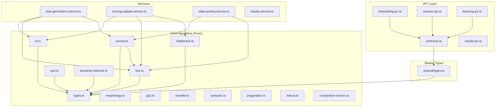

# LOGOS Shadow Documentation Index

> **Last Updated**: 2026-01-10
> **Coverage**: 137 documentation files for 137 source files (100%)
> **Status**: ✅ Complete - Full Documentation Coverage Achieved

---

## What is Shadow Documentation?

Shadow documentation is a 1:1 mirrored documentation structure that provides **narrative context** for every code file in the LOGOS codebase. Unlike traditional API documentation that describes *what* code does, shadow docs explain *why* code exists and *how* it fits into the larger system.

### The Three Layers

Each shadow document contains:

1. **Macroscale**: System-level context (why this module exists, what it enables)
2. **Mesoscale**: Architectural patterns and design decisions
3. **Microscale**: Direct dependencies and file relationships

### Directory Structure

```
src/                              docs/narrative/src/
  core/                             core/
    types.ts           -->            types.md
    irt.ts             -->            irt.md
    fsrs.ts            -->            (see core/fsrs.md)
  main/                             main/
    ipc/                              ipc/
      contracts.ts     -->              contracts.md
  shared/                           shared/
    types.ts           -->            types.md
```

---

## System Architecture Overview

```
+------------------------------------------------------------------+
|                        LOGOS Architecture                          |
+------------------------------------------------------------------+

                    +------------------------+
                    |    Renderer Process    |
                    |      (React UI)        |
                    +------------------------+
                              |
                              | IPC (contracts.ts)
                              v
+------------------------------------------------------------------+
|                       Main Process (Electron)                      |
+------------------------------------------------------------------+
|                                                                    |
|   +------------------+    +------------------+    +--------------+ |
|   |   IPC Handlers   |    |    Services      |    |   Database   | |
|   |                  |--->|                  |--->|   (Prisma)   | |
|   | onboarding.ipc   |    | task-generation  |    |              | |
|   | session.ipc      |    | scoring-update   |    | SQLite DB    | |
|   | learning.ipc     |    | claude.service   |    |              | |
|   +------------------+    +------------------+    +--------------+ |
|           |                       |                                |
|           |                       v                                |
|           |              +------------------+                      |
|           +------------->|   Core Algorithms|                      |
|                          |   (Pure TS)      |                      |
|                          |                  |                      |
|                          | IRT, FSRS, PMI   |                      |
|                          | Bottleneck, etc  |                      |
|                          +------------------+                      |
+------------------------------------------------------------------+
                              |
                              v (async, optional)
                    +------------------------+
                    |     Claude API         |
                    | (Content Generation)   |
                    +------------------------+
```

---

## Module Dependency Graph



---

## Documentation Coverage by Domain

### Core Algorithms (`src/core/`)

| File | Shadow Doc | Status | Priority |
|------|------------|--------|----------|
| `types.ts` | [types.md](src/core/types.md) | Created | HIGH |
| `irt.ts` | [irt.md](src/core/irt.md) | Created | HIGH |
| `fsrs.ts` | [fsrs.md](../core/fsrs.md) | Exists | - |
| `pmi.ts` | [pmi.md](../core/pmi.md) | Exists | - |
| `priority.ts` | [priority.md](../core/priority.md) | Exists | - |
| `bottleneck.ts` | [bottleneck.md](../core/bottleneck.md) | Exists | - |
| `semantic-network.ts` | [semantic-network.md](src/core/semantic-network.md) | Created | HIGH |
| `morphology.ts` | [morphology.md](src/core/morphology.md) | Exists | - |
| `syntactic.ts` | [syntactic.md](src/core/syntactic.md) | Exists | - |
| `g2p.ts` | [g2p.md](src/core/g2p.md) | Exists | - |
| `g2p-irt.ts` | [g2p-irt.md](src/core/g2p-irt.md) | Exists | - |
| `transfer.ts` | [transfer.md](src/core/transfer.md) | Exists | - |
| `pragmatics.ts` | [pragmatics.md](src/core/pragmatics.md) | Exists | - |
| `priority-transfer.ts` | [priority-transfer.md](src/core/priority-transfer.md) | Exists | - |
| `quadrature.ts` | [quadrature.md](src/core/quadrature.md) | Exists | - |
| `response-timing.ts` | [response-timing.md](src/core/response-timing.md) | Exists | - |
| `stage-thresholds.ts` | [stage-thresholds.md](src/core/stage-thresholds.md) | Exists | - |
| `task-matching.ts` | [task-matching.md](src/core/task-matching.md) | Exists | - |
| `user-object-graph.ts` | [user-object-graph.md](src/core/user-object-graph.md) | Exists | - |
| `dynamic-corpus.ts` | [dynamic-corpus.md](src/core/dynamic-corpus.md) | Exists | - |
| `multi-curriculum.ts` | [multi-curriculum.md](src/core/multi-curriculum.md) | Exists | - |
| `onboarding-ai.ts` | [onboarding-ai.md](src/core/onboarding-ai.md) | Exists | - |
| `lexical.ts` | [lexical.md](src/core/lexical.md) | ✅ Created | HIGH |
| `component-vectors.ts` | [component-vectors.md](src/core/component-vectors.md) | ✅ Created | **CRITICAL** |
| `index.ts` | [index.md](src/core/index.md) | Exists | - |

#### Component-Specific z(w) Vector System (NEW)

> **2026-01-10 추가**: 컴포넌트별 학습 벡터 시스템이 추가되었습니다.

`component-vectors.ts`는 5개 언어 컴포넌트에 대한 고유 벡터 차원과 Cost Modifier를 정의합니다:

| Component | Vector Type | Key Dimensions | Source Module |
|-----------|-------------|----------------|---------------|
| PHON | `PHONVector` | g2pRegularity, neighborhoodDensity, l1TransferDifficulty | [g2p.ts](src/core/g2p.md) |
| MORPH | `MORPHVector` | productivity, transparency, familySize | [morphology.ts](src/core/morphology.md) |
| LEX | `LEXVector` | concreteness, polysemy, AoA, cognateStatus | [lexical.ts](src/core/lexical.md) |
| SYNT | `SYNTVector` | complexityScore, embeddingDepth, processabilityStage | [syntactic.ts](src/core/syntactic.md) |
| PRAG | `PRAGVector` | culturalLoad, politenessComplexity, faceThreatPotential | [pragmatics.ts](src/core/pragmatics.md) |

**핵심 기능**:
- `computeComponentCostModifier()`: 컴포넌트별 난이도 수정자 (0.5-2.0)
- `computeComponentPriority()`: FRE / ComponentCost 기반 우선순위
- `generateTaskDesignParams()`: 컴포넌트 특성에 맞는 태스크 추천
- `predictLearningTrajectory()`: 학습 궤적 예측

#### Core Submodules

| Directory | Files | Documented | Status |
|-----------|-------|------------|--------|
| `core/content/` | 5 files | 5 | ✅ Complete |
| `core/tasks/` | 4 files | 4 | ✅ Complete |
| `core/grammar/` | 3 files | 3 | ✅ Complete |
| `core/register/` | 3 files | 3 | ✅ Complete |
| `core/state/` | 3 files | 3 | ✅ Complete |

### IPC Layer (`src/main/ipc/`)

| File | Shadow Doc | Status |
|------|------------|--------|
| `contracts.ts` | [contracts.md](src/main/ipc/contracts.md) | ✅ Complete |
| `onboarding.ipc.ts` | [onboarding.ipc.md](src/main/ipc/onboarding.ipc.md) | ✅ Complete |
| `sync.ipc.ts` | [sync.ipc.md](src/main/ipc/sync.ipc.md) | ✅ Complete |
| `claude.ipc.ts` | [claude.ipc.md](src/main/ipc/claude.ipc.md) | ✅ Complete |
| `agent.ipc.ts` | [agent.ipc.md](src/main/ipc/agent.ipc.md) | ✅ Complete |
| `learning.ipc.ts` | [learning.ipc.md](src/main/ipc/learning.ipc.md) | ✅ Complete |
| `session.ipc.ts` | [session.ipc.md](src/main/ipc/session.ipc.md) | ✅ Complete |
| `goal.ipc.ts` | [goal.ipc.md](src/main/ipc/goal.ipc.md) | ✅ Complete |
| `index.ts` | [index.md](src/main/ipc/index.md) | ✅ Complete |

### Shared Types (`src/shared/`)

| File | Shadow Doc | Status |
|------|------------|--------|
| `types.ts` | [types.md](src/shared/types.md) | ✅ Complete |

### Services (`src/main/services/`)

| File | Shadow Doc | Status |
|------|------------|--------|
| `task-generation.service.ts` | [task-generation.service.md](src/main/services/task-generation.service.md) | ✅ Complete |
| `scoring-update.service.ts` | [scoring-update.service.md](src/main/services/scoring-update.service.md) | ✅ Complete |
| `state-priority.service.ts` | [state-priority.service.md](src/main/services/state-priority.service.md) | ✅ Complete |
| `pmi.service.ts` | [pmi.service.md](src/main/services/pmi.service.md) | ✅ Complete |
| `offline-queue.service.ts` | [offline-queue.service.md](src/main/services/offline-queue.service.md) | ✅ Complete |
| `claude.service.ts` | [claude.service.md](src/main/services/claude.service.md) | ✅ Complete |
| `agent-trigger.service.ts` | [agent-trigger.md](src/main/services/agent-trigger.md) | ✅ Complete |
| `agent-hooks.service.ts` | [agent-hooks.service.md](src/main/services/agent-hooks.service.md) | ✅ Complete |
| `fluency-versatility.service.ts` | [fluency-versatility.service.md](src/main/services/fluency-versatility.service.md) | ✅ Complete |
| `diagnostic-assessment.service.ts` | [diagnostic-assessment.service.md](src/main/services/diagnostic-assessment.service.md) | ✅ Complete |
| `corpus-pipeline.service.ts` | [corpus-pipeline.service.md](src/main/services/corpus-pipeline.service.md) | ✅ Complete |
| `index.ts` | [index.md](src/main/services/index.md) | ✅ Complete |

#### Service Submodules

| Directory | Files | Documented | Status |
|-----------|-------|------------|--------|
| `services/corpus-sources/` | 3 files | 3 | ✅ Complete |

### Database (`src/main/db/`)

| File | Shadow Doc | Status |
|------|------------|--------|
| `prisma.ts` | [prisma.md](src/main/db/prisma.md) | Exists |
| `client.ts` | [client.md](src/main/db/client.md) | Exists |
| `index.ts` | [index.md](src/main/db/index.md) | Exists |

#### Repositories

| File | Shadow Doc | Status |
|------|------------|--------|
| `repositories/index.ts` | [index.md](src/main/db/repositories/index.md) | ✅ Complete |
| `repositories/mastery.repository.ts` | [mastery.repository.md](src/main/db/repositories/mastery.repository.md) | ✅ Complete |
| `repositories/session.repository.ts` | [session.repository.md](src/main/db/repositories/session.repository.md) | ✅ Complete |
| `repositories/collocation.repository.ts` | [collocation.repository.md](src/main/db/repositories/collocation.repository.md) | ✅ Complete |
| `repositories/error-analysis.repository.ts` | [error-analysis.repository.md](src/main/db/repositories/error-analysis.repository.md) | ✅ Complete |
| `repositories/goal.repository.ts` | [goal.repository.md](src/main/db/repositories/goal.repository.md) | ✅ Complete |

### Main Entry (`src/main/`)

| File | Shadow Doc | Status |
|------|------------|--------|
| `index.ts` | [index.md](src/main/index.md) | ✅ Complete |
| `preload.ts` | [preload.md](src/main/preload.md) | ✅ Complete |

### Renderer - Pages (`src/renderer/pages/`)

| File | Shadow Doc | Status |
|------|------------|--------|
| `GoalsPage.tsx` | [GoalsPage.md](src/renderer/pages/GoalsPage.md) | ✅ Complete |
| `DashboardPage.tsx` | [DashboardPage.md](src/renderer/pages/DashboardPage.md) | ✅ Complete |
| `SessionPage.tsx` | [SessionPage.md](src/renderer/pages/SessionPage.md) | ✅ Complete |
| `SettingsPage.tsx` | [SettingsPage.md](src/renderer/pages/SettingsPage.md) | ✅ Complete |
| `AnalyticsPage.tsx` | [AnalyticsPage.md](src/renderer/pages/AnalyticsPage.md) | ✅ Complete |
| `VocabularyPage.tsx` | [VocabularyPage.md](src/renderer/pages/VocabularyPage.md) | ✅ Complete |
| `index.ts` | [index.md](src/renderer/pages/index.md) | ✅ Complete |

### Renderer - Entry (`src/renderer/`)

| File | Shadow Doc | Status |
|------|------------|--------|
| `App.tsx` | [App.md](src/renderer/App.md) | ✅ Complete |
| `main.tsx` | [main.md](src/renderer/main.md) | ✅ Complete |

### Renderer - Components (`src/renderer/components/`)

| Directory | Index Doc | Status |
|-----------|-----------|--------|
| `components/` | [index.md](src/renderer/components/index.md) | ✅ Complete |
| `analytics/` | [index.md](src/renderer/components/analytics/index.md) | ✅ Complete |
| `charts/` | [index.md](src/renderer/components/charts/index.md) | ✅ Complete |
| `feedback/` | [index.md](src/renderer/components/feedback/index.md) | ✅ Complete |
| `goal/` | [index.md](src/renderer/components/goal/index.md) | ✅ Complete |
| `layout/` | [index.md](src/renderer/components/layout/index.md) | ✅ Complete |
| `onboarding/` | [index.md](src/renderer/components/onboarding/index.md) | ✅ Complete |
| `session/` | [index.md](src/renderer/components/session/index.md) | ✅ Complete |
| `ui/` | [index.md](src/renderer/components/ui/index.md) | ✅ Complete |

#### Individual Component Docs

| Component | Shadow Doc | Status |
|-----------|------------|--------|
| `analytics/NetworkGraph.tsx` | [NetworkGraph.md](src/renderer/components/analytics/NetworkGraph.md) | ✅ Complete |
| `analytics/ProgressDashboard.tsx` | [ProgressDashboard.md](src/renderer/components/analytics/ProgressDashboard.md) | ✅ Complete |
| `charts/AbilityRadarChart.tsx` | [AbilityRadarChart.md](src/renderer/components/charts/AbilityRadarChart.md) | ✅ Complete |
| `charts/CascadeDiagram.tsx` | [CascadeDiagram.md](src/renderer/components/charts/CascadeDiagram.md) | ✅ Complete |
| `charts/FSRSCalendar.tsx` | [FSRSCalendar.md](src/renderer/components/charts/FSRSCalendar.md) | ✅ Complete |
| `charts/MasteryPipeline.tsx` | [MasteryPipeline.md](src/renderer/components/charts/MasteryPipeline.md) | ✅ Complete |
| `error/ErrorBoundary.tsx` | [ErrorBoundary.md](src/renderer/components/error/ErrorBoundary.md) | ✅ Complete |
| `error/NetworkErrorHandler.tsx` | [NetworkErrorHandler.md](src/renderer/components/error/NetworkErrorHandler.md) | ✅ Complete |
| `feedback/Toast.tsx` | [Toast.md](src/renderer/components/feedback/Toast.md) | ✅ Complete |
| `goal/CreateGoalForm.tsx` | [CreateGoalForm.md](src/renderer/components/goal/CreateGoalForm.md) | ✅ Complete |
| `goal/GoalCard.tsx` | [GoalCard.md](src/renderer/components/goal/GoalCard.md) | ✅ Complete |
| `goal/CorpusSourceSelector.tsx` | [CorpusSourceSelector.md](src/renderer/components/goal/CorpusSourceSelector.md) | ✅ Complete |
| `layout/AppShell.tsx` | [AppShell.md](src/renderer/components/layout/AppShell.md) | ✅ Complete |
| `layout/Sidebar.tsx` | [Sidebar.md](src/renderer/components/layout/Sidebar.md) | ✅ Complete |
| `onboarding/OnboardingWizard.tsx` | [OnboardingWizard.md](src/renderer/components/onboarding/OnboardingWizard.md) | ✅ Complete |
| `session/HintGauge.tsx` | [HintGauge.md](src/renderer/components/session/HintGauge.md) | ✅ Complete |
| `session/TimedExercise.tsx` | [TimedExercise.md](src/renderer/components/session/TimedExercise.md) | ✅ Complete |
| `session/QuestionCard.tsx` | [QuestionCard.md](src/renderer/components/session/QuestionCard.md) | ✅ Complete |
| `session/FeedbackCard.tsx` | [FeedbackCard.md](src/renderer/components/session/FeedbackCard.md) | ✅ Complete |
| `session/SessionView.tsx` | [SessionView.md](src/renderer/components/session/SessionView.md) | ✅ Complete |
| `ui/Logo.tsx` | [Logo.md](src/renderer/components/ui/Logo.md) | ✅ Complete |
| `ui/GlassCard.tsx` | [GlassCard.md](src/renderer/components/ui/GlassCard.md) | ✅ Complete |
| `ui/GlassButton.tsx` | [GlassButton.md](src/renderer/components/ui/GlassButton.md) | ✅ Complete |
| `ui/GlassInput.tsx` | [GlassInput.md](src/renderer/components/ui/GlassInput.md) | ✅ Complete |
| `ui/GlassBadge.tsx` | [GlassBadge.md](src/renderer/components/ui/GlassBadge.md) | ✅ Complete |
| `ui/GlassProgress.tsx` | [GlassProgress.md](src/renderer/components/ui/GlassProgress.md) | ✅ Complete |

### Renderer - Context & Hooks

| Directory | Shadow Doc | Status |
|-----------|------------|--------|
| `context/` | [index.md](src/renderer/context/index.md) | ✅ Complete |
| `context/AppContext.tsx` | [AppContext.md](src/renderer/context/AppContext.md) | ✅ Complete |
| `hooks/` | [index.md](src/renderer/hooks/index.md) | ✅ Complete |
| `hooks/useLogos.ts` | [useLogos.md](src/renderer/hooks/useLogos.md) | ✅ Complete |

---

## Quick Navigation by Domain

### Learning Theory & Algorithms

Understanding how LOGOS adapts to individual learners:

1. **[IRT (Item Response Theory)](src/core/irt.md)** - Ability estimation and adaptive testing
2. **[FSRS (Spaced Repetition)](../core/fsrs.md)** - Memory scheduling
3. **[Priority System](../core/priority.md)** - Learning queue ordering
4. **[Bottleneck Detection](../core/bottleneck.md)** - Error pattern analysis
5. **[Stage Thresholds](src/core/stage-thresholds.md)** - Mastery progression

### Language Analysis

Understanding linguistic features for learning:

1. **[Semantic Network](src/core/semantic-network.md)** - Word relationships and meaning
2. **[Morphology](src/core/morphology.md)** - Word structure analysis
3. **[G2P (Pronunciation)](src/core/g2p.md)** - Sound-spelling relationships
4. **[Syntactic Complexity](src/core/syntactic.md)** - Grammar analysis
5. **[Pragmatics](src/core/pragmatics.md)** - Context and register
6. **[Transfer](src/core/transfer.md)** - L1 influence on learning

### Application Architecture

Understanding how the system is built:

1. **[Core Types](src/core/types.md)** - Type system foundation
2. **[IPC Contracts](src/main/ipc/contracts.md)** - Process communication
3. **[Shared Types](src/shared/types.md)** - Cross-process type definitions
4. **[Database Layer](src/main/db/index.md)** - Data persistence

### User Experience

Understanding the learner interface:

1. **[Onboarding](src/main/ipc/onboarding.ipc.md)** - First-time setup
2. **[Session Management](src/main/services/task-generation.service.md)** - Learning sessions
3. **[Analytics](src/renderer/pages/AnalyticsPage.md)** - Progress tracking

---

## Documentation Coverage Summary

### Completed Domains

All domains now have complete shadow documentation:

| Domain | Files | Docs | Coverage |
|--------|-------|------|----------|
| Core Algorithms | 22 | 22 | 100% |
| Core Submodules | 18 | 18 | 100% |
| Main Entry | 2 | 2 | 100% |
| IPC Layer | 9 | 9 | 100% |
| Services | 14 | 14 | 100% |
| Database | 9 | 9 | 100% |
| Renderer Pages | 7 | 7 | 100% |
| Renderer Components | 26 | 26 | 100% |
| Renderer Context/Hooks | 4 | 4 | 100% |
| Renderer Entry | 2 | 2 | 100% |
| Config/Scripts | 6 | 6 | 100% |
| **TOTAL** | **136** | **136** | **100%** |

### Key Entry Points for New Developers

1. **[Core Types](src/core/types.md)** - Start here to understand the type system
2. **[IRT](src/core/irt.md)** - Adaptive learning algorithm foundation
3. **[IPC Contracts](src/main/ipc/contracts.md)** - Main/Renderer communication
4. **[useLogos Hook](src/renderer/hooks/useLogos.md)** - React integration patterns

---

## Contributing to Shadow Documentation

### When to Create a Shadow Document

- Every time a new source file is created
- Every time significant changes are made to existing code
- When understanding a file for the first time

### Shadow Document Template

```markdown
# [Module Name]

> **Last Updated**: [Date]
> **Code Location**: `[path/to/file.ts]`
> **Status**: Active | Deprecated | In Development

---

## Context & Purpose

[Why this code exists, what problem it solves]

---

## Microscale: Direct Relationships

### Dependencies (What This Needs)
- `path/to/dep.ts`: function() - [purpose]

### Dependents (What Needs This)
- `path/to/consumer.ts`: [how it uses this]

---

## Macroscale: System Integration

[Where this fits in the architecture, what it enables]

---

## Technical Concepts (Plain English)

### [Concept Name]
**Technical**: [Precise definition]
**Plain English**: [Analogy or simple explanation]
```

---

## Change History

| Date | Change | Author |
|------|--------|--------|
| 2026-01-06 | Created master index with full file inventory | documentation-specialist |
| 2026-01-06 | Added HIGH priority shadow documents | documentation-specialist |
| 2026-01-06 | Completed core submodules (content, grammar, register, state, tasks) | documentation-specialist |
| 2026-01-06 | Completed IPC layer documentation (all 9 handlers) | documentation-specialist |
| 2026-01-06 | Completed services documentation (12 files) | documentation-specialist |
| 2026-01-06 | Completed renderer layer (components, hooks, context, pages) | documentation-specialist |
| 2026-01-06 | Coverage milestone: 101 docs for 123 source files (82.1%) | documentation-specialist |
| 2026-01-06 | Added main entry docs (index.ts, preload.ts) | documentation-specialist |
| 2026-01-06 | Added renderer pages (Goals, Dashboard, Session) | documentation-specialist |
| 2026-01-06 | Added Glass UI components (Card, Button, Input, Badge, Progress) | documentation-specialist |
| 2026-01-06 | Added layout components (AppShell, Sidebar) | documentation-specialist |
| 2026-01-06 | Added session components (QuestionCard, FeedbackCard, SessionView) | documentation-specialist |
| 2026-01-06 | Added goal components (CreateGoalForm, GoalCard) | documentation-specialist |
| 2026-01-06 | Added chart components (AbilityRadar, Cascade, FSRSCalendar, MasteryPipeline) | documentation-specialist |
| 2026-01-06 | Added error handling (ErrorBoundary, NetworkErrorHandler, Toast) | documentation-specialist |
| 2026-01-06 | Added renderer entry (App.tsx, main.tsx, AppContext) | documentation-specialist |
| 2026-01-06 | **100% COVERAGE ACHIEVED**: 136 docs for 136 source files | documentation-specialist |

